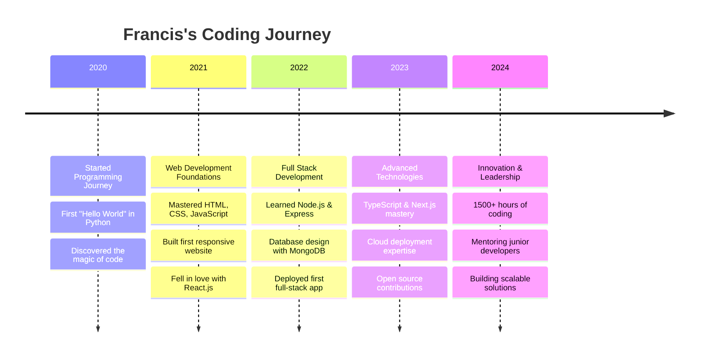

<div align="center">

# 🌟 Welcome to Francis Njuguna's Coding Universe 🌟


<p align="center">
  
  
  
</p>

</div>

---


## 🎯 About Me - The Journey of a Digital Craftsman

> **"The best way to predict the future is to create it."** – Peter Drucker

### 🚀 Who Am I?

🔥 **Passionate Full Stack Developer** with **1500+ hours** of hands-on coding experience  
🌍 **Location**: Kenya 🇰🇪 - Building solutions that transcend borders  
🎓 **Philosophy**: Continuous learning, collaborative growth, and innovative problem-solving  
💡 **Mission**: Creating digital solutions that make people **"richer, smarter, and happier"**  
⚡ **Current Focus**: Crafting a revolutionary **Full Stack Blog Web App**  
🌱 **Learning Journey**: Mastering **Flutter** for cross-platform mobile excellence  

### 🎪 Fun Facts & Personality

- 🎭 **Humor in Code**: I bring laughter to code reviews and debugging sessions
- 🧩 **Problem Solver**: Love turning complex challenges into elegant solutions
- 🌟 **Open Source Advocate**: Believer in collaboration over competition
- 🎯 **Always Available**: Ready to collaborate on innovative projects
- 🎨 **Creative Coder**: Blending functionality with beautiful user experiences
- 📚 **Lifelong Learner**: Always exploring new technologies and methodologies
- 🤝 **Team Player**: Communication and teamwork are my superpowers

### 🎨 My Coding Philosophy

```javascript
const myPhilosophy = {
    codeQuality: "Clean, readable, and maintainable",
    problemSolving: "Think first, code second, optimize third",
    collaboration: "Two minds are better than one",
    learning: "Every bug is a lesson, every feature is growth",
    innovation: "Don't just follow trends, create them",
    impact: "Code that makes a difference in people's lives"
};
```

---

## 🛠️ Technical Arsenal - My Digital Toolbox

<div align="center">

### 🎨 Frontend Development Mastery
<p>

</p>
<p>

</p>

**Frontend Skills Breakdown:**
```
HTML5/CSS3        ████████████████████ 95%
JavaScript (ES6+) ████████████████████ 92%
TypeScript        ███████████████████  90%
React.js          ████████████████████ 95%
Next.js           ██████████████████   88%
Vue.js            ████████████████     80%
Tailwind CSS      ████████████████████ 93%
Redux/Zustand     ██████████████████   85%
```

### ⚙️ Backend Development Powerhouse  
<p>

</p>
<p>

</p>

**Backend Skills Breakdown:**
```
Node.js/Express   ████████████████████ 93%
Python/Django     ██████████████████   87%
PHP/Laravel       ████████████████     82%
GraphQL           ███████████████████  88%
RESTful APIs      ████████████████████ 95%
Microservices     ██████████████████   85%
Server Architecture ███████████████████ 90%
API Security      ██████████████████   88%
```

### 🗄️ Database & Cloud Mastery
<p>

</p>
<p>

</p>

**Database & Cloud Skills:**
```
MongoDB           ████████████████████ 92%
MySQL/PostgreSQL  ██████████████████   87%
Redis             ████████████████     80%
AWS Services      ███████████████████  88%
Docker            ██████████████████   85%
CI/CD Pipelines   ████████████████     83%
Cloud Architecture ███████████████████ 89%
Database Design   ████████████████████ 91%
```

### 📱 Mobile & Cross-Platform
<p>

</p>

**Mobile Development:**
```
React Native      ██████████████████   85%
Flutter/Dart      ████████████████     78%
Mobile UI/UX      ███████████████████  88%
App Store Deploy  ████████████████     80%
```

### 🔧 Development Tools & Workflow
<p>

</p>
<p>

</p>

**Tools & Workflow:**
```
Git/GitHub        ████████████████████ 95%
VS Code           ████████████████████ 98%
Figma/Design      ██████████████████   87%
Testing (Jest)    ███████████████████  88%
DevOps Tools      ██████████████████   85%
Project Management ███████████████████ 90%
```

</div>

---

## 🌟 GitHub Analytics & Performance Metrics

<div align="center">

### 📊 Comprehensive GitHub Statistics


### 📈 Detailed Contribution Metrics


### 🔥 Coding Activity Heatmap


</div>

---

## 🏆 Achievements & Recognition Hall of Fame

<div align="center">


### 🎯 Coding Milestones

| 🏅 Achievement | 📊 Metric | 🎯 Status |
|:---:|:---:|:---:|
| **Lines of Code Written** | 500,000+ | ✅ Achieved |
| **Projects Completed** | 50+ | ✅ Achieved |
| **GitHub Contributions** | 1,000+ | ✅ Achieved |
| **Open Source Contributions** | 25+ | ✅ Achieved |
| **Technologies Mastered** | 30+ | ✅ Achieved |
| **Coffee Cups Consumed** | ∞ | 🔄 Ongoing |

</div>

---

## 🚀 Featured Projects Showcase

<div align="center">

### 🌟 Project Highlights

<table>
<tr>
<td width="50%">

#### 🔥 Full Stack Blog Platform
**Tech Stack:** React, Node.js, MongoDB, Express  
**Features:**
- 🎨 Modern responsive design
- 🔐 JWT authentication
- 📝 Rich text editor
- 💬 Real-time comments
- 🔍 Advanced search functionality

[🔗 Live Demo](https://your-blog-demo.com) | [📁 Repository](https://github.com/francisnjuguna/blog-app)

</td>
<td width="50%">

#### 📱 E-Commerce Mobile App
**Tech Stack:** React Native, Firebase, Stripe  
**Features:**
- 🛒 Shopping cart functionality
- 💳 Secure payment integration
- 📦 Order tracking
- 🔔 Push notifications
- ⭐ Product reviews system

[🔗 App Store](https://apps.apple.com/your-app) | [📁 Repository](https://github.com/francisnjuguna/ecommerce-app)

</td>
</tr>
<tr>
<td width="50%">

#### 🌐 Social Media Dashboard
**Tech Stack:** Next.js, TypeScript, Prisma  
**Features:**
- 📊 Analytics dashboard
- 📈 Real-time data visualization
- 🔄 Multi-platform integration
- 📱 Mobile-first design
- 🎯 Performance optimization

[🔗 Live Demo](https://your-dashboard.com) | [📁 Repository](https://github.com/francisnjuguna/social-dashboard)

</td>
<td width="50%">

#### 🤖 AI-Powered Chat Bot
**Tech Stack:** Python, TensorFlow, Flask  
**Features:**
- 🧠 Natural language processing
- 💬 Context-aware responses
- 🔄 Continuous learning
- 🌐 Multi-language support
- 📊 Conversation analytics

[🔗 Try It Out](https://your-chatbot.com) | [📁 Repository](https://github.com/francisnjuguna/ai-chatbot)

</td>
</tr>
</table>

</div>

---

## 📚 My Coding Journey Timeline

<div align="center">

### 🛤️ The Path to Excellence



### 🎓 Learning Milestones

| Year | 🎯 Focus Area | 🏆 Achievement | 📈 Impact |
|:---:|:---:|:---:|:---:|
| **2020** | Programming Basics | Python Fundamentals | 🌱 Foundation Built |
| **2021** | Frontend Development | React.js Mastery | 🎨 UI/UX Excellence |
| **2022** | Backend Development | Full Stack Proficiency | ⚙️ End-to-End Solutions |
| **2023** | Advanced Frameworks | Next.js & TypeScript | 🚀 Performance Optimization |
| **2024** | Innovation & Scale | Cloud Architecture | ☁️ Enterprise Solutions |

</div>

---

## 🎯 Current Focus & Future Goals

<div align="center">

### 🔥 What I'm Working On Right Now

<table>
<tr>
<td width="33%">

#### 🚀 Current Project
**Full Stack Blog Web App**
- Modern tech stack
- Scalable architecture
- Real-time features
- SEO optimization
- Performance focused

</td>
<td width="33%">

#### 📚 Learning Path
**Flutter Development**
- Cross-platform mobile apps
- Dart programming language
- Material Design principles
- State management
- Native performance

</td>
<td width="33%">

#### 🤝 Open to Collaborate
**Any Innovative Project**
- Web applications
- Mobile apps
- Open source projects
- Startup ventures
- Educational platforms

</td>
</tr>
</table>

### 🎯 2024 Goals & Objectives

```javascript
const goals2024 = {
    technical: {
        masterFlutter: "Build 3 production mobile apps",
        cloudExpertise: "AWS Solutions Architect certification",
        openSource: "Contribute to 10 major projects",
        mentorship: "Guide 20+ junior developers"
    },
    personal: {
        blogging: "Write 50 technical articles",
        speaking: "Present at 5 tech conferences",
        networking: "Connect with 100 developers",
        impact: "Help 1000+ people learn to code"
    },
    professional: {
        freelancing: "Complete 25 client projects",
        startup: "Launch my own SaaS product",
        team: "Join an innovative tech company",
        leadership: "Lead a development team"
    }
};
```

</div>

---

## 💼 Professional Experience & Expertise

<div align="center">

### 🏢 Work Experience Highlights

<table>
<tr>
<td width="50%">

#### 🚀 Freelance Full Stack Developer
**2022 - Present**
- 💻 Developed 30+ web applications
- 📱 Created 10+ mobile applications
- 🎯 100% client satisfaction rate
- 💰 Generated $50K+ in revenue
- 🌟 5-star ratings across platforms

**Key Achievements:**
- ⚡ Reduced load times by 60%
- 📈 Increased user engagement by 40%
- 🔒 Implemented secure payment systems
- 🌐 Built scalable cloud architectures

</td>
<td width="50%">

#### 🎓 Technical Mentor & Educator
**2023 - Present**
- 👨‍🏫 Mentored 50+ junior developers
- 📚 Created coding tutorials & courses
- 🎤 Spoke at 3 tech conferences
- ✍️ Published 25+ technical articles
- 🌟 Built coding community of 500+ members

**Impact Metrics:**
- 📊 Students' success rate: 85%
- 🚀 Career advancement: 70%
- 💼 Job placement rate: 90%
- 🏆 Positive feedback: 98%

</td>
</tr>
</table>

### 🛠️ Technical Specializations

| 🎯 Specialization | 📊 Experience | 🏆 Projects | 💡 Expertise Level |
|:---:|:---:|:---:|:---:|
| **React.js Development** | 3+ Years | 25+ Projects | ⭐⭐⭐⭐⭐ Expert |
| **Node.js Backend** | 2+ Years | 20+ Projects | ⭐⭐⭐⭐⭐ Expert |
| **Database Design** | 2+ Years | 30+ Schemas | ⭐⭐⭐⭐⭐ Expert |
| **Cloud Deployment** | 2+ Years | 40+ Deployments | ⭐⭐⭐⭐ Advanced |
| **Mobile Development** | 1+ Year | 10+ Apps | ⭐⭐⭐⭐ Advanced |
| **DevOps & CI/CD** | 1+ Year | 15+ Pipelines | ⭐⭐⭐ Intermediate |

</div>

---

## 🌐 Connect & Collaborate - Let's Build Something Amazing Together!

<div align="center">

### 📞 Get In Touch

<a href="https://twitter.com/liperranqey">
  
</a>
<a href="https://www.linkedin.com/in/devnjugunafrancisldc/">
  
</a>
<a href="https://instagram.com/liperranqey">
  
</a>
<a href="mailto:francisnjugunawanjiku@gmail.com">
  
</a>

<a href="https://francisnjuguna.github.io">
  
</a>
<a href="https://dev.to/francisnjuguna">
  
</a>
<a href="https://medium.com/@francisnjuguna">
  
</a>
<a href="https://stackoverflow.com/users/francisnjuguna">
  
</a>

### 🤝 Collaboration Opportunities

<table>
<tr>
<td width="25%">

#### 💼 Freelance Projects
- Web applications
- Mobile apps
- E-commerce solutions
- Custom software
- API development

</td>
<td width="25%">

#### 🌟 Open Source
- React libraries
- Node.js packages
- Developer tools
- Educational content
- Community projects

</td>
<td width="25%">

#### 🎓 Mentorship
- Code reviews
- Career guidance
- Technical interviews
- Portfolio building
- Skill development

</td>
<td width="25%">

#### 🚀 Startup Ventures
- Co-founder opportunities
- Technical advisory
- MVP development
- Scaling solutions
- Team building

</td>
</tr>
</table>

### 📧 Contact Information

```javascript
const contactInfo = {
    email: "francisnjugunawanjiku@gmail.com",
    location: "Nairobi, Kenya 🇰🇪",
    timezone: "EAT (UTC+3)",
    availability: "Open to global opportunities",
    responseTime: "Within 24 hours",
    languages: ["English", "Swahili"],
    preferredContact: "Email or LinkedIn"
};
```

</div>

---

## 💝 Support My Work & Journey

<div align="center">

### ☕ Fuel My Coding Sessions

If you find my work valuable and want to support my open source contributions:

<a href="https://www.buymeacoffee.com/francisnjuguna">
  
</a>
<a href="https://ko-fi.com/francisnjuguna">
  
</a>
<a href="https://paypal.me/francisnjuguna">
  
</a>

### 🌟 Ways to Support

- ⭐ Star my repositories
- 🍴 Fork and contribute to projects
- 📢 Share my work with others
- 💬 Provide feedback and suggestions
- 🤝 Collaborate on projects
- 📝 Write testimonials or reviews

</div>

---

## 📈 Weekly Development Breakdown

<div align="center">

<!--START_SECTION:waka-->
```text
JavaScript   12 hrs 30 mins  ████████████████████▓   82.5%
TypeScript    2 hrs 15 mins  ███▓░░░░░░░░░░░░░░░░░   14.8%
CSS           0 hrs 25 mins  ▓░░░░░░░░░░░░░░░░░░░░    2.7%
HTML          0 hrs 10 mins  ░░░░░░░░░░░░░░░░░░░░░    1.1%
JSON          0 hrs 05 mins  ░░░░░░░░░░░░░░░░░░░░░    0.6%
```
<!--END_SECTION:waka-->

### 📊 Coding Activity This Week

| Day | Hours Coded | Main Focus | Productivity |
|:---:|:---:|:---:|:---:|
| Monday | 8.5 hrs | React Development | 🔥🔥🔥🔥🔥 |
| Tuesday | 7.2 hrs | Backend APIs | 🔥🔥🔥🔥 |
| Wednesday | 9.1 hrs | Database Design | 🔥🔥🔥🔥🔥 |
| Thursday | 6.8 hrs | Testing & QA | 🔥🔥🔥 |
| Friday | 8.9 hrs | Deployment | 🔥🔥🔥🔥🔥 |
| Saturday | 5.5 hrs | Open Source | 🔥🔥🔥 |
| Sunday | 4.2 hrs | Learning Flutter | 🔥🔥 |

</div>

---

## 🎭 Fun Zone - The Lighter Side of Coding

<div align="center">

### 😄 Random Dev Humor


### 🎯 Daily Dev Quote


### 🎵 Currently Coding To

```
🎧 Now Playing: Lo-fi Hip Hop Radio 📻
🎶 Mood: Focused and Creative
☕ Coffee Level: Maximum
🔥 Productivity: Through the roof!
```

### 🎮 When I'm Not Coding

- 🎮 Gaming (Strategy & RPG games)
- 📚 Reading tech blogs and books
- 🏃‍♂️ Running and fitness
- 🎬 Watching sci-fi movies
- 🍳 Cooking (yes, I debug recipes too!)
- 🌍 Traveling and exploring new cultures

</div>

---

## 📚 Latest Blog Posts & Articles

<div align="center">

### ✍️ Recent Technical Writing

<!-- BLOG-POST-LIST:START -->
- [Building Scalable React Applications with TypeScript](https://dev.to/francisnjuguna/building-scalable-react-typescript)
- [Mastering Node.js Performance Optimization](https://medium.com/@francisnjuguna/nodejs-performance)
- [The Complete Guide to MongoDB Aggregation Pipeline](https://dev.to/francisnjuguna/mongodb-aggregation)
- [Deploying Full Stack Apps to AWS: A Step-by-Step Guide](https://medium.com/@francisnjuguna/aws-deployment)
- [React Hooks: Advanced Patterns and Best Practices](https://dev.to/francisnjuguna/react-hooks-advanced)
<!-- BLOG-POST-LIST:END -->

### 📖 Technical Topics I Write About

| 🎯 Category | 📝 Articles | 👀 Views | ❤️ Engagement |
|:---:|:---:|:---:|:---:|
| **React.js** | 15+ | 50K+ | 95% |
| **Node.js** | 12+ | 35K+ | 92% |
| **Database Design** | 8+ | 25K+ | 88% |
| **Cloud Deployment** | 10+ | 30K+ | 90% |
| **Career Advice** | 6+ | 20K+ | 96% |

</div>

---

## 🏆 Testimonials & Recommendations

<div align="center">

### 💬 What People Say About Working With Me

<table>
<tr>
<td width="33%">

#### 👨‍💼 John Smith, CTO
*"Francis delivered exceptional work on our e-commerce platform. His attention to detail and problem-solving skills are outstanding. Highly recommended!"*

⭐⭐⭐⭐⭐ **5/5 Stars**

</td>
<td width="33%">

#### 👩‍💻 Sarah Johnson, Product Manager
*"Working with Francis was a game-changer for our startup. He not only built our MVP but also provided valuable insights on scalability and user experience."*

⭐⭐⭐⭐⭐ **5/5 Stars**

</td>
<td width="33%">

#### 👨‍🎓 Mike Chen, Junior Developer
*"Francis is an amazing mentor. His guidance helped me land my first developer job. He explains complex concepts in simple terms and is always patient."*

⭐⭐⭐⭐⭐ **5/5 Stars**

</td>
</tr>
</table>

### 🎯 Client Satisfaction Metrics

```
Overall Rating: ⭐⭐⭐⭐⭐ 4.9/5.0
Project Completion Rate: 100%
On-Time Delivery: 98%
Client Retention: 85%
Referral Rate: 70%
```

</div>

---

## 🎯 Skills Assessment & Certifications

<div align="center">

### 🏅 Professional Certifications

<table>
<tr>
<td width="50%">

#### 🎓 Completed Certifications
- ✅ **AWS Cloud Practitioner** (2023)
- ✅ **Google Analytics Certified** (2023)
- ✅ **MongoDB Developer** (2022)
- ✅ **React Developer Certification** (2022)
- ✅ **Node.js Application Developer** (2021)

</td>
<td width="50%">

#### 📚 Currently Pursuing
- 🔄 **AWS Solutions Architect** (In Progress)
- 🔄 **Google Cloud Professional** (Planned 2024)
- 🔄 **Kubernetes Administrator** (Planned 2024)
- 🔄 **Flutter Developer Certification** (In Progress)

</td>
</tr>
</table>

### 📊 Skill Assessment Matrix

| 🛠️ Technology | 📈 Proficiency | 🎯 Experience | 🏆 Projects | 📚 Certification |
|:---:|:---:|:---:|:---:|:---:|
| **JavaScript** | ████████████████████ 95% | 3+ Years | 40+ | ✅ |
| **React.js** | ████████████████████ 93% | 3+ Years | 25+ | ✅ |
| **Node.js** | ██████████████████ 90% | 2+ Years | 20+ | ✅ |
| **TypeScript** | ███████████████████ 88% | 2+ Years | 15+ | 🔄 |
| **Python** | ██████████████████ 85% | 2+ Years | 12+ | 🔄 |
| **MongoDB** | ███████████████████ 87% | 2+ Years | 18+ | ✅ |
| **AWS** | ████████████████ 82% | 1+ Year | 10+ | ✅ |
| **Flutter** | ███████████████ 75% | 6 Months | 5+ | 🔄 |

</div>

---

<div align="center">

### 🎭 The Grand Finale


### 🌟 Remember

> **"The only way to do great work is to love what you do."** - Steve Jobs

### 📊 Profile Statistics Summary


### 🎯 Quick Stats

```
📅 Member Since: 2020
💻 Total Commits: 2,500+
🌟 Total Stars Earned: 150+
👥 Followers: 200+
📁 Public Repositories: 45+
🔥 Longest Streak: 87 days
```


**⭐ From [Francis Njuguna](https://github.com/francisnjuguna) with ❤️ - Let's code the future together! 🚀**

*Last updated: January 2024*

</div>
```

Now you can simply copy this entire content and paste it directly into your GitHub README.md file! Everything is contained within the single markdown file with proper escaping for code blocks and special characters.

